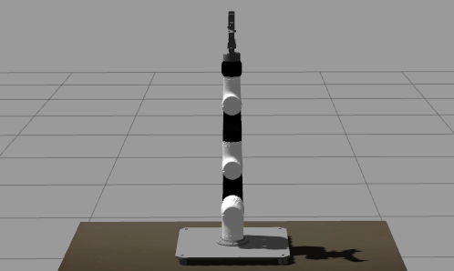

# gym-gazebo2

<a href="http://www.acutronicrobotics.com"></a>

**gym-gazebo2 is a toolkit for developing and comparing reinforcement learning algorithms using ROS 2 and Gazebo**. Built as an extension of [gym-gazebo](https://github.com/AcutronicRobotics/gym-gazebo/tree/dashing), gym-gazebo2 has been redesigned with community feedback and adopts now a standalone architecture while mantaining the core concepts of previous work inspired originally by the OpenAI gym.

[](https://travis-ci.org/AcutronicRobotics/gym-gazebo2) [](https://arxiv.org/pdf/1903.06278.pdf)

This work presents an upgraded, real world application oriented version of gym-gazebo, the Robot Operating System (ROS) and Gazebo based Reinforcement Learning (RL) toolkit, which complies with OpenAI Gym. A whitepaper about this work is available at https://arxiv.org/abs/1903.06278. Please use the following BibTex entry to cite our work:

```
@misc{1903.06278,
Author = {Nestor Gonzalez Lopez and Yue Leire Erro Nuin and Elias Barba Moral and Lander Usategui San Juan and Alejandro Solano Rueda and Víctor Mayoral Vilches and Risto Kojcev},
Title = {gym-gazebo2, a toolkit for reinforcement learning using ROS 2 and Gazebo},
Year = {2019},
Eprint = {arXiv:1903.06278},
}
```

A whitepaper regarding previous work of gym-gazebo is available at https://arxiv.org/abs/1608.05742.

**gym-gazebo2** is a complex piece of software for roboticists that puts together simulation tools, robot middlewares (ROS 2), machine learning and reinforcement learning techniques. All together to create an environment where to benchmark and develop behaviors with robots. Setting up `gym-gazebo2` appropriately requires relevant familiarity with these tools.

**Docs**. In-depth explanations and actively growing tutorials can be found at https://acutronicrobotics.com/docs. The following is an example of what you can achieve using gym-gazebo2 as a submodule of [ros2learn](https://github.com/AcutronicRobotics/ros2learn) repository. The goal is to reach the green target.
 - 1. Left image shows the start of a training
 - 2. To the right we execute an already trained policy.

<p align="center">
   
</p>

<!--<p align="center">
  <a href="https://acutronicrobotics.com/docs/technology/api/ros_api/gym_gazebo"> </a>
</p>-->

---

## Table of Contents
- [Environments](#environments)
  - [MARA](#mara)
    - [Real Robot](#real-robot)
    - [Simulated Robot](#simulated-robot)
- [Installation](#installation)
- [Usage](#usage)
  - [Executing an algorithm](#executing-an-algorithm)
  - [Script parameters](#script-parameters)
  - [gzserver-gzclient](#gzserver-gzclient)


## Environments
The code for each environment group is housed in its own subdirectory
[gym_gazebo2/envs](https://github.com/AcutronicRobotics/gym-gazebo2/blob/dashing/gym_gazebo2/envs). Robot specific simulation files should be housed in robot specific ROS2 packages.

### MARA
#### Real Robot

<p>


MARA stands for Modular Articulated Robotic Arm and is a collaborative robotic arm with ROS 2 in each actuator, sensor or any other representative module. Each module has native ROS 2 support, can be physically extended in a seamless manner and delivers industrial-grade features including synchronization, deterministic communication latencies, a ROS 2 software and hardware component lifecycle, and more. Altogether, MARA empowers new possibilities and applications in the professional landscape of robotics. Learn more or even order one at [acutronicrobotics.com](https://acutronicrobotics.com)!
</p>

#### Simulated Robot

<p>


MARA also provides an accurate simulated version in Gazebo, which allows to translate behaviors from the simulated environment to the real robot. This is the version we will be training in gym-gazebo2. Please refer to [github.com/acutronicRobotics/MARA](https://github.com/acutronicRobotics/MARA) for additional simulation related content for Gazebo, MoveIt! and rviz2.
</p><br>

## Installation

Please refer to [INSTALL.md](/INSTALL.md) to install it from source.

Refer to [docker/README.md](/docker/README.md) for gym-gazebo2 Docker container installation and usage instructions.

## Usage

### Executing an algorithm

**Note**: In Dashing we need to use opensplice implementation of DDS, since Fast-RTPS and others are still buggy and not supported well in this use case. Please export the OpenSplice DDS implementation manually or use the provisioning script before running/training any example of the MARA enviroment.

```sh
export RMW_IMPLEMENTATION=rmw_opensplice_cpp
```

If you added the privisioning script to your `~/.bashrc`, you can directly execute the algorithm. Load the environment variables manually otherwise.

```sh
cd ~/gym-gazebo2/examples/MARA
python3 gg_random.py -g
```
### Script parameters

Every MARA environment provides three command-line customization arguments. You can read the details by using the ``-h`` option in any MARA-script (e.g: `python3 gazebo_mara_4actions.py -h`). The help message is the following:

```sh
usage: gg_random.py [-h] [-g] [-r] [-v VELOCITY] [-m | -p PORT]

MARA environment argument provider.

optional arguments:
  -h, --help            show this help message and exit
  -g, --gzclient        Run user interface.
  -r, --realSpeed      Execute the simulation in real speed and using the
                        running specific driver.
  -v VELOCITY, --velocity VELOCITY
                        Set servo motor velocity. Keep < 1.57 for real speed.
                        Applies only with -r --realSpeed option.
  -m, --multiInstance  Provide network segmentation to allow multiple
                        instances.
  -p PORT, --port PORT  Provide exact port to the network segmentation to
                        allow multiple instances.
```

### gzserver-gzclient

If you want to get faster simulation speeds, you should launch the simulation withouht the visual interface of gazebo. But it is possible that you want to check the learnt policy at some point without stoping the training, so this is how you do it:

- Launch the visual interfaze of gazebo:

```sh
gzclient
```

- If you used the `-m --multiInstance` option to provide network segmentation, do the following:

In a new terminal, set the corresponding `GAZEBO_MASTER_URI`: For convinience, this environment variable is printed at the beginning of every Env execution. Just copy and export it. You can also find information related to any running execution inside `/tmp/gym-gazebo2/running/` folder. Example:
```sh
export GAZEBO_MASTER_URI=http://localhost:11285
```
Finally launch the client:
```sh
gzclient
```
Final note: you can launch as many `gzserver` and `gzclient` instances as you want as long as you manage properly the `GAZEBO_MASTER_URI` environment variable.

## What's new

- 2019-03-15: Release of gym-gazebo2 with ROS2 compatibility and MARA environments.
- 2019-03-27: Improve observation for MARA environments. Check out the [published article](https://acutronicrobotics.com/news/ros2learn-gymgazebo2-state-observations-hyperparameters/).
